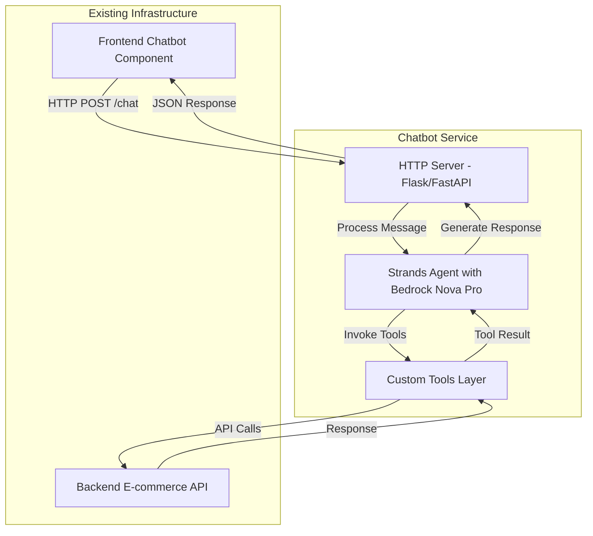

# Design Document: Shopping Assistant Chatbot Service

## Overview

The Shopping Assistant Chatbot Service is a Python-based backend service that provides conversational AI capabilities for an e-commerce application. Built on the Strands Agents SDK with AWS Bedrock Nova Pro as the underlying language model, the service enables users to interact naturally with the shopping platform through a chat interface.

The service architecture consists of three main layers:
1. **HTTP Server Layer**: Handles incoming requests from the frontend chatbot component
2. **Agent Layer**: Manages conversation context and orchestrates interactions with the LLM
3. **Tools Layer**: Provides custom functions that enable the agent to interact with the backend e-commerce API

The chatbot supports key shopping operations including product browsing, cart management, and personalized recommendations, all through natural language conversation.

## Architecture

### System Components



### Technology Stack

- **Language**: Python 3.9+
- **Agent Framework**: Strands Agents SDK
- **LLM Provider**: AWS Bedrock (Nova Pro model)
- **HTTP Framework**: Flask or FastAPI
- **HTTP Client**: requests library for backend API calls
- **Session Management**: In-memory dictionary (simple implementation) or FileSessionManager for persistence
- **Environment Management**: python-dotenv for configuration

### Deployment Architecture

The chatbot service will run as a standalone Python application:
- Listens on a configurable port (default: 5001)
- Communicates with the existing backend API on port 5000
- Receives requests from the frontend on port 3000
- AWS credentials configured via environment variables

## Components and Interfaces

### 1. HTTP Server Module (`server.py`)

**Responsibility**: Handle HTTP requests and responses for the chatbot interface

**Key Functions**:
- `create_app()`: Initialize Flask/FastAPI application with CORS configuration
- `POST /chat`: Main endpoint for processing chat messages

**Request Format**:
```json
{
  "message": "Show me all products",
  "session_id": "user-123-session-456"
}
```

**Response Format**:
```json
{
  "response": "Here are the available products...",
  "session_id": "user-123-session-456"
}
```

**Error Response Format**:
```json
{
  "error": "Error message description",
  "session_id": "user-123-session-456"
}
```

### 2. Agent Module (`agent.py`)

**Responsibility**: Manage the Strands Agent lifecycle and conversation context

**Key Functions**:
- `create_agent()`: Initialize Bedrock model and agent with tools
- `process_message(message: str, session_id: str)`: Process user message and return response
- `get_or_create_session(session_id: str)`: Manage session-based conversation history

**Agent Configuration**:
- Model: AWS Bedrock Nova Pro (`us.amazon.nova-pro-v1:0`)
- Temperature: 0.7 (balanced creativity and consistency)
- System Prompt: Defines chatbot personality and capabilities
- Tools: All custom shopping tools registered
- Session Management: FileSessionManager for conversation persistence

### 3. Tools Module (`tools.py`)

**Responsibility**: Provide custom tools for the agent to interact with the backend API

**Tool Definitions**:

#### `list_products()`
- **Description**: Retrieve all available products from the catalog
- **Parameters**: None
- **Returns**: List of products with id, name, emoji, price, description
- **Backend API**: `GET http://localhost:5000/api/products`

#### `get_product_details(product_id: int)`
- **Description**: Get detailed information about a specific product including reviews
- **Parameters**: 
  - `product_id`: The ID of the product to retrieve
- **Returns**: Product details with reviews
- **Backend API**: `GET http://localhost:5000/api/products/{product_id}`

#### `get_cart()`
- **Description**: Retrieve current shopping cart contents
- **Parameters**: None
- **Returns**: List of cart items with product details and quantities
- **Backend API**: `GET http://localhost:5000/api/cart`

#### `add_to_cart(product_id: int, quantity: int)`
- **Description**: Add a product to the shopping cart or update quantity if exists
- **Parameters**:
  - `product_id`: The ID of the product to add
  - `quantity`: The quantity to add (default: 1)
- **Returns**: Confirmation message
- **Backend API**: `POST http://localhost:5000/api/cart`

#### `update_cart_item(cart_item_id: int, quantity: int)`
- **Description**: Update the quantity of an item in the cart
- **Parameters**:
  - `cart_item_id`: The ID of the cart item to update
  - `quantity`: The new quantity
- **Returns**: Confirmation message
- **Backend API**: `PUT http://localhost:5000/api/cart/{cart_item_id}`

#### `remove_from_cart(cart_item_id: int)`
- **Description**: Remove an item from the shopping cart
- **Parameters**:
  - `cart_item_id`: The ID of the cart item to remove
- **Returns**: Confirmation message
- **Backend API**: `DELETE http://localhost:5000/api/cart/{cart_item_id}`

### 4. Configuration Module (`config.py`)

**Responsibility**: Manage environment variables and application configuration

**Configuration Parameters**:
- `AWS_ACCESS_KEY_ID`: AWS access key for Bedrock authentication
- `AWS_SECRET_ACCESS_KEY`: AWS secret key for Bedrock authentication
- `AWS_SESSION_TOKEN`: Optional AWS session token for temporary credentials
- `AWS_REGION`: AWS region for Bedrock service (default: "us-west-2")
- `BACKEND_API_URL`: Base URL for the e-commerce backend API (default: "http://localhost:5000")
- `CHATBOT_PORT`: Port for the chatbot service (default: 5001)
- `SESSION_STORAGE_DIR`: Directory for storing session data (default: "./sessions")

## Data Models

### Message Format

Messages follow the Strands Agents SDK format:

```python
{
    "role": "user" | "assistant",
    "content": [
        {
            "text": "message content"
        }
    ]
}
```

### Product Model

```python
{
    "id": int,
    "emoji": str,
    "name": str,
    "price": float,
    "description": str
}
```

### Cart Item Model

```python
{
    "id": int,  # cart item id
    "product_id": int,
    "quantity": int,
    "product": Product  # nested product object
}
```

### Review Model

```python
{
    "id": int,
    "product_id": int,
    "author": str,
    "rating": int,  # 1-5
    "comment": str
}
```

### Session Data

```python
{
    "session_id": str,
    "agent": Agent,  # Strands Agent instance with conversation history
    "created_at": datetime,
    "last_accessed": datetime
}
```

## Correctness Properties

*A property is a characteristic or behavior that should hold true across all valid executions of a system-essentially, a formal statement about what the system should do. Properties serve as the bridge between human-readable specifications and machine-verifiable correctness guarantees.*


### Property Reflection

Before defining the correctness properties, I've reviewed the prework analysis to identify and eliminate redundant properties:

**Redundancies Identified:**
1. Properties 3.1-3.5, 4.1-4.4, 5.1-5.4, 6.1-6.4, 7.1-7.4, and 9.1-9.4 follow the same pattern: intent recognition → tool invocation → API call → data return → response generation. These can be consolidated into more general properties about tool invocation and response generation.
2. Error handling properties (3.5, 4.5, 6.5, 7.5, 9.5, 11.1) can be combined into a single comprehensive error handling property.
3. Response generation properties (3.4, 4.4, 5.4, 6.4, 7.4, 9.4) can be combined into a single property about response completeness.

**Consolidated Approach:**
- Create general properties for tool invocation patterns rather than tool-specific properties
- Create a single comprehensive error handling property
- Create a single property for response generation that includes necessary data
- Keep session management and configuration properties as they provide unique validation

### Correctness Properties

Property 1: Message processing returns response
*For any* valid user message sent to the chatbot service, the service should return a response via HTTP
**Validates: Requirements 1.2, 1.3**

Property 2: Tool invocation for shopping operations
*For any* user request that requires shopping operations (listing products, managing cart, getting product details), the chatbot service should invoke the appropriate custom tool
**Validates: Requirements 3.1, 4.1, 5.1, 6.1, 7.1, 8.1, 9.1**

Property 3: Tool API calls match specification
*For any* custom tool invocation, the tool should call the correct backend API endpoint with the correct HTTP method and parameters
**Validates: Requirements 3.2, 4.2, 5.2, 6.2, 7.2, 9.2**

Property 4: Tool data flow completeness
*For any* successful backend API response, the custom tool should return the complete data to the agent without loss of information
**Validates: Requirements 3.3, 4.3, 5.3, 6.3, 7.3, 9.3**

Property 5: Response contains tool data
*For any* agent response generated after receiving tool data, the response should contain or reference the key information from that tool data
**Validates: Requirements 3.4, 4.4, 5.4, 6.4, 7.4, 9.4**

Property 6: Comprehensive error handling
*For any* error that occurs (API errors, network errors, invalid inputs, LLM failures), the system should catch the error, log it appropriately, and return a user-friendly error message without crashing
**Validates: Requirements 1.5, 3.5, 11.1, 11.2, 11.3, 11.4**

Property 7: Configuration validation at startup
*For any* missing required AWS credential (access key or secret key), the chatbot service should fail to start with a clear error message indicating which credential is missing
**Validates: Requirements 2.4, 11.5**

Property 8: Recommendation product validity
*For any* product recommendation generated by the chatbot, all recommended products should exist in the current product catalog
**Validates: Requirements 8.3**

Property 9: Session conversation persistence
*For any* sequence of messages within the same session, later messages should have access to the context from earlier messages in that session
**Validates: Requirements 12.1, 12.3**

Property 10: Session isolation
*For any* new session ID, the conversation should start with a fresh context that does not contain messages from other sessions
**Validates: Requirements 12.5**

## Error Handling

### Error Categories and Handling Strategy

#### 1. Configuration Errors
**Scenarios**:
- Missing AWS credentials
- Invalid AWS region
- Missing backend API URL

**Handling**:
- Fail fast at startup with clear error messages
- Log configuration errors with details about what's missing
- Do not start the HTTP server if configuration is invalid

#### 2. Network Errors
**Scenarios**:
- Backend API unreachable
- Bedrock API timeout
- Connection refused

**Handling**:
- Catch all network exceptions in tool functions
- Return structured error messages to the agent
- Log full error details for debugging
- Return HTTP 503 (Service Unavailable) to frontend

#### 3. API Errors
**Scenarios**:
- Backend returns 404 (product not found)
- Backend returns 400 (invalid request)
- Backend returns 500 (server error)

**Handling**:
- Parse error responses from backend API
- Convert to user-friendly messages
- Return appropriate HTTP status codes to frontend
- Log API errors with request/response details

#### 4. LLM Errors
**Scenarios**:
- Bedrock throttling
- Invalid model response
- Token limit exceeded

**Handling**:
- Catch Bedrock-specific exceptions
- Retry with exponential backoff for throttling
- Return fallback responses for parsing errors
- Log LLM errors with prompt context

#### 5. Session Errors
**Scenarios**:
- Session not found
- Session storage failure
- Corrupted session data

**Handling**:
- Create new session if not found
- Log session errors
- Gracefully degrade to stateless mode if session storage fails

### Error Response Format

All errors returned to the frontend follow this format:
```json
{
  "error": "User-friendly error message",
  "error_type": "configuration|network|api|llm|session",
  "session_id": "session-id-if-available"
}
```

## Testing Strategy

### Unit Testing

Unit tests will verify individual components in isolation:

**Configuration Module Tests**:
- Test loading valid environment variables
- Test handling missing required variables
- Test default value assignment

**Tools Module Tests**:
- Test each tool function with mocked API responses
- Test error handling for API failures
- Test parameter validation
- Test response parsing

**Agent Module Tests**:
- Test agent initialization with mocked Bedrock
- Test session creation and retrieval
- Test message processing flow

**Server Module Tests**:
- Test HTTP endpoint with mocked agent
- Test request validation
- Test error response formatting
- Test CORS configuration

### Property-Based Testing

Property-based tests will verify universal properties across many inputs using the **Hypothesis** library for Python:

**Testing Framework**: Hypothesis (https://hypothesis.readthedocs.io/)
**Configuration**: Each property test will run a minimum of 100 iterations

**Property Test Requirements**:
- Each property-based test MUST be tagged with a comment explicitly referencing the correctness property from this design document
- Tag format: `# Feature: shopping-assistant-chatbot, Property {number}: {property_text}`
- Each correctness property MUST be implemented by a SINGLE property-based test
- Tests should use Hypothesis strategies to generate diverse test inputs

**Property Test Coverage**:
- Property 1: Generate random valid messages and verify responses are returned
- Property 2: Generate various shopping-related requests and verify correct tool invocation
- Property 3: Generate tool invocations and verify correct API calls
- Property 4: Generate API responses and verify data completeness in tool returns
- Property 5: Generate tool data and verify it appears in agent responses
- Property 6: Generate various error scenarios and verify proper error handling
- Property 7: Generate configurations with missing credentials and verify startup failures
- Property 8: Generate recommendations and verify all products exist in catalog
- Property 9: Generate message sequences and verify context persistence
- Property 10: Generate new sessions and verify context isolation

### Integration Testing

Integration tests will verify end-to-end functionality:

**Full Flow Tests**:
- Test complete conversation flows (browse → add to cart → checkout)
- Test multi-turn conversations with context
- Test error recovery scenarios

**API Integration Tests**:
- Test against real backend API (in test mode)
- Verify all tool-to-API interactions
- Test with various product catalog states

**Session Persistence Tests**:
- Test session creation and retrieval
- Test conversation history persistence
- Test session isolation between users

### Testing Best Practices

- Mock external dependencies (Bedrock, Backend API) in unit tests
- Use test fixtures for common test data (products, cart items)
- Test both success and failure paths
- Verify logging output in error scenarios
- Use integration tests sparingly for critical paths
- Property tests should focus on invariants, not specific examples

## System Prompt Design

The agent's system prompt will define its personality and capabilities:

```
You are a helpful shopping assistant for an e-commerce store. Your role is to help customers:

1. Browse and discover products in our catalog
2. Get detailed information about products including reviews
3. Manage their shopping cart (add, update, remove items)
4. Receive personalized product recommendations

Guidelines:
- Be friendly, concise, and helpful
- When showing products, include the emoji, name, and price
- When recommending products, explain why they might be a good fit
- If a customer asks about a product not in the catalog, politely let them know it's not available
- Always confirm actions like adding to cart or removing items
- If you encounter an error, apologize and suggest an alternative action

You have access to tools that let you:
- list_products: Get all available products
- get_product_details: Get detailed info about a specific product
- get_cart: View the customer's current cart
- add_to_cart: Add items to the cart
- update_cart_item: Change quantities in the cart
- remove_from_cart: Remove items from the cart

Use these tools to help customers accomplish their shopping goals.
```

## Performance Considerations

### Response Time Targets
- HTTP endpoint response: < 3 seconds for simple queries
- Tool execution: < 500ms per tool call
- LLM response generation: < 2 seconds

### Optimization Strategies
- Use streaming responses from Bedrock when possible
- Cache product catalog for short periods (30 seconds)
- Implement connection pooling for backend API calls
- Use async/await for concurrent tool execution

### Scalability Considerations
- Session storage should be moved to Redis/DynamoDB for production
- Consider rate limiting per session
- Implement request queuing for high load
- Monitor Bedrock token usage and costs

## Security Considerations

### Credential Management
- Never log AWS credentials
- Use IAM roles instead of access keys when deployed to AWS
- Rotate credentials regularly
- Use AWS Secrets Manager for production deployments

### Input Validation
- Validate all user inputs before processing
- Sanitize session IDs to prevent injection attacks
- Limit message length to prevent abuse
- Validate product IDs and quantities

### API Security
- Use HTTPS for all external communications
- Implement CORS properly to restrict origins
- Add authentication/authorization for production
- Rate limit requests per session/IP

## Deployment Considerations

### Environment Setup
1. Install Python 3.9+ and dependencies
2. Configure AWS credentials via environment variables or IAM role
3. Ensure backend API is running and accessible
4. Configure CORS to allow frontend origin
5. Set up session storage directory with appropriate permissions

### Production Recommendations
- Deploy as a containerized service (Docker)
- Use AWS ECS/Fargate or EC2 for hosting
- Implement health check endpoints
- Set up CloudWatch logging and monitoring
- Use Application Load Balancer for high availability
- Implement auto-scaling based on request volume

### Monitoring and Observability
- Log all requests and responses (excluding sensitive data)
- Track tool invocation metrics
- Monitor Bedrock API usage and costs
- Set up alerts for error rates and latency
- Implement distributed tracing for debugging

## Future Enhancements

### Potential Features
- Multi-language support
- Voice input/output integration
- Product image analysis
- Order history and tracking
- Personalized recommendations based on purchase history
- Integration with payment processing
- Proactive notifications (price drops, back in stock)

### Technical Improvements
- Implement caching layer for frequently accessed data
- Add support for multiple LLM providers
- Implement A/B testing for system prompts
- Add analytics for conversation quality
- Implement feedback collection mechanism
